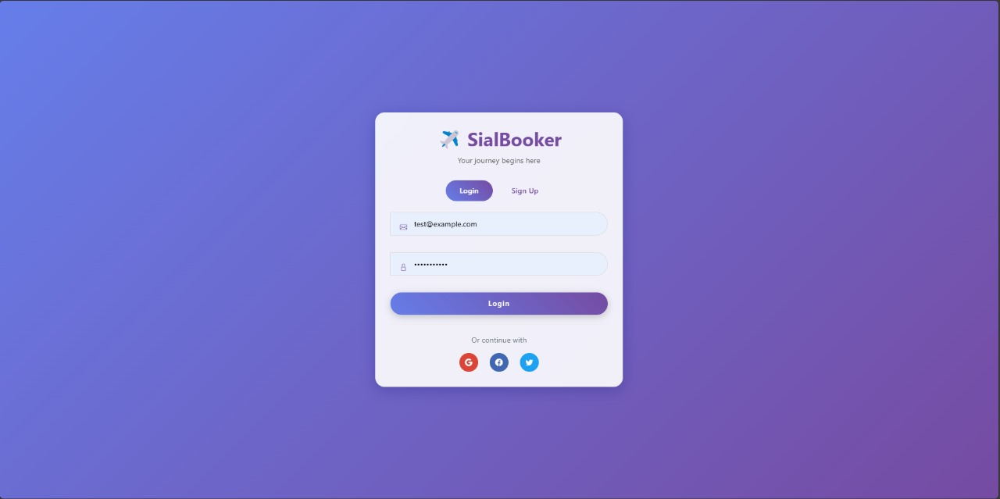
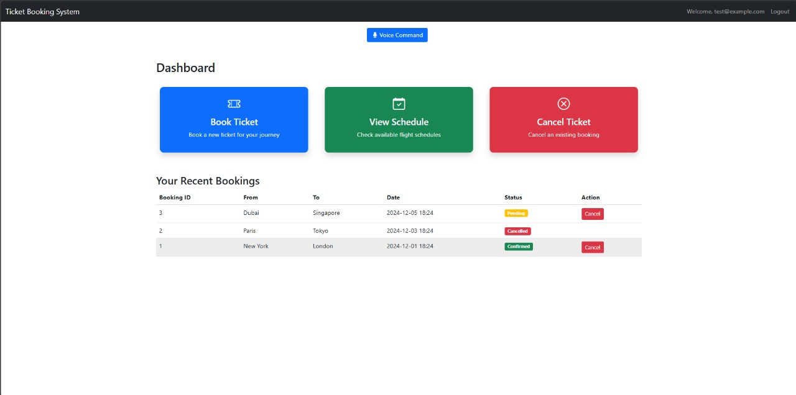
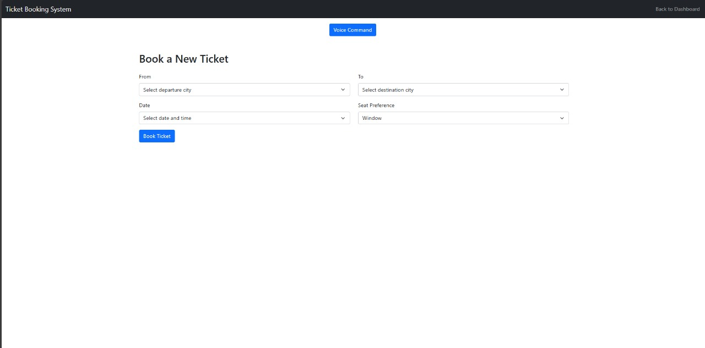
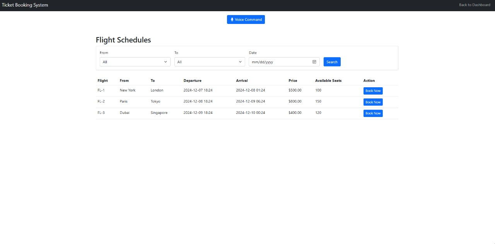
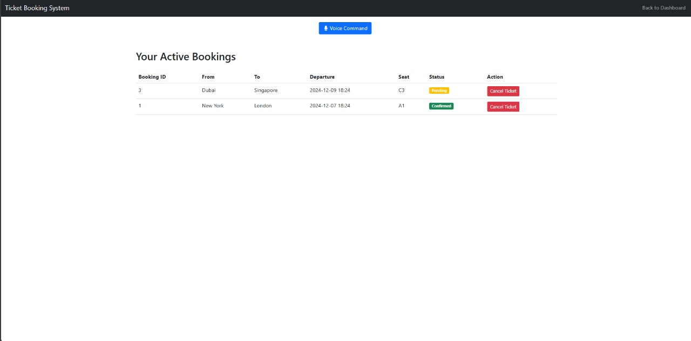

# Voice-Enabled Ticket Booking System 🎫 🎤

A modern web application that allows users to book tickets using voice commands, built with FastAPI and Python. 🚀

## Features 🌟

- Voice Command Recognition 🎙️
- User Authentication & Authorization 🔐 
- Ticket Booking System 🎫
- Schedule Viewing 📅
- Ticket Cancellation ❌

## Interface






## Architecture 🏗️
mermaid
graph TD
A[Client Browser] -->|Voice Input| B[FastAPI Backend]
B --> C[Speech Recognition]
B --> D[Database]
C --> E[Command Processing]
E --> F[Ticket Management]
F --> D


## Tech Stack 💻

- **Frontend**: HTML, JavaScript, Bootstrap
- **Backend**: FastAPI (Python)
- **Database**: SQLAlchemy with SQLite
- **Voice Processing**: 
  - FFmpeg for audio conversion
  - Speech Recognition for command detection
- **Authentication**: JWT Tokens

## Prerequisites 📋

```bash
# Python 3.8+
python --version

# FFmpeg
ffmpeg -version

# Virtual Environment
python -m venv venv
```

## Installation 🛠️

```bash
# Clone the repository
git clone <repository-url>
cd <project-directory>

# Activate virtual environment
# On Windows
.\venv\Scripts\activate
# On Unix or MacOS
source venv/bin/activate

# Install dependencies
pip install -r requirements.txt
```

## Environment Setup ⚙️

Create a `.env` file in the root directory:

## Tech Stack 💻

- **Frontend**: HTML, JavaScript, Bootstrap
- **Backend**: FastAPI (Python)
- **Database**: SQLAlchemy with SQLite
- **Voice Processing**: 
  - FFmpeg for audio conversion
  - Speech Recognition for command detection
- **Authentication**: JWT Tokens

## Prerequisites 📋

```bash
# Python 3.8+
python --version

# FFmpeg
ffmpeg -version

# Virtual Environment
python -m venv venv
```

## Installation 🛠️

```bash
# Clone the repository
git clone <repository-url>
cd <project-directory>

# Activate virtual environment
# On Windows
.\venv\Scripts\activate
# On Unix or MacOS
source venv/bin/activate

# Install dependencies
pip install -r requirements.txt
```


# Install dependencies
```bash
pip install -r requirements.txt
```


## Environment Setup ⚙️

Create a `.env` file in the root directory:

env
SECRET_KEY=your_secret_key_here
ALGORITHM=HS256
ACCESS_TOKEN_EXPIRE_MINUTES=30


## Running the Application 🚀

```bash
# Start the FastAPI server
uvicorn main:app --reload
```

Visit `http://localhost:8000` in your browser.

## Voice Commands 🎙️

The system recognizes the following voice commands:
- "Book a ticket" → Redirects to booking page
- "Show schedule" → Displays available schedules  
- "Cancel ticket" → Takes you to cancellation page

## API Endpoints 🛣️
```
POST /token - Authentication
GET /dashboard - Main dashboard
POST /process-voice - Voice command processing
GET /book-ticket - Ticket booking
GET /view-schedule - Schedule viewing
GET /cancel-ticket - Ticket cancellation
```

## Database Schema 📊
mermaid
erDiagram
USER ||--o{ TICKET : books
USER {
string email
string hashed_password
string full_name
}
TICKET {
int id
string user_email
datetime booking_date
string status
}


## Contributing 🤝

1. Fork the repository
2. Create your feature branch
3. Commit your changes
4. Push to the branch
5. Create a Pull Request

## License 📄

This project is licensed under the MIT License - see the [LICENSE](LICENSE) file for details.

## Acknowledgments 🙏

- FastAPI Documentation
- Speech Recognition Library
- FFmpeg Project

## Contact 📧

Your Name - sattar.husnain123@gmail.com
Project Link: [https://github.com/husnainsr/Voice-Booking-Reservation](https://github.com/husnainsr/Voice-Booking-Reservation)

---
⭐ Star this repository if you find it helpful!